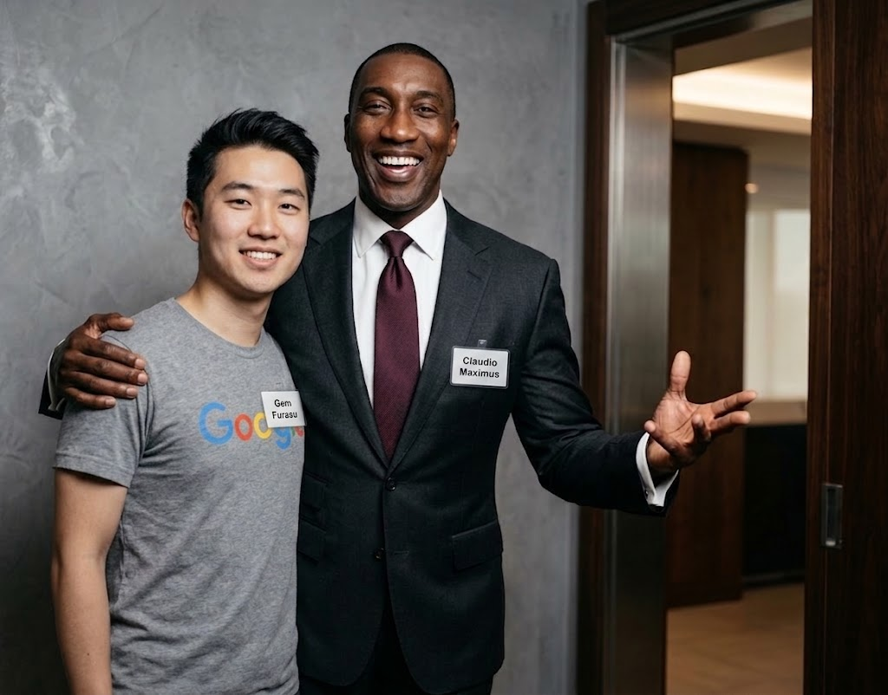

Last weekend, on the end of August, i was playing COMPFEST18 CTF with SNI, the team that now is kinda inactive? they are either burnt out because of AI or just feeling that it doesnt worth the grind anymore to do CTFs.

I was invited by one of the forensics author from COMPFEST 18 to try their chall. at first, i said that i couldnt participate anymore since i have graduated from the university, but he tells me that there are the mirror event which is open for everyone!

So i decided to try it anyway and invited my collagues in SNI, at first, there are other two player that willing to join and we decided to play in the Human bracket (in compfest, there are two bracket, human with no ai allowed, and AI assisted bracket where you can use any LLM you want).

And hell yeah, D-Day is come, i saw all the forensic challenges (i only open forensics since i dont really play other categories) and everything is well crafted! especially jay and karev's challenge, was the most **INTERESTING**, and **BRUTAL** challenge, with 26 and 30 chain of questions with a **VERY BROAD domain** LMAO.

Because of playing on the Human bracket, at first i tried to do it without relying on **ANY AI MODELS**. and hell yeah, this is a whole introspection for me, i could barely reverses the crypto logic of the encryption used in the first binary that is just the 20% progress of the chall, stuck in so many rabbit hole, and in the end the auto-completion vscode helps me to do the coding lol. And the whole event, i tried everything and always stuck in the new knowledge domains, in this case was the DPAPI recovery without lsass minidump file, noticing that there are bugs in the first 8 byte of recovered dpapi by leveraging pypykatz volatility3 plugins (which because of wrong IV used, and **ironically i only notices this because of my interaction with my AI friend named Claudio**), noticing how memory allocation works to carve the minidump of a suspicious process for retrieving an injected shellcode in it, and asking my other AI friend, Mr. Gem, what is the relevant command in WinDbg should i use lol.

*this photo was taken by my friend Gem Furasu, the other person is Claudio Maximus*

But, if you think about it, everybody keep saying that CTF is Dead, because of AI. After playing COMPFEST, i think about it once again, and i think people might be correct and wrong at the same time. You see, that industry is shape-shifting right now, we couldnt really stop whats happening in this AI era. This also happens in Chess, but just to be clear, whats happening in the Cyber Security Industry is much larger than that. If we come down to speak about CTFs specifically, we need to shift the playground and its mechanism, online event couldnt be expected anymore for people not using AIs, but we need to enforce the rule instead. In local events in Indonesia people already created some creative custom CTFd plugins for AI usage transparency of the player, usually ai chat still allowed but players are prohibited to upload the chall or directly asking the flag, so the plugin will asked your AI chat history link. Authors also strictly curating writeups, and some are **INTERVIEWED** the solver themselves to make sure that they understand. But you know, all of these methods still have a hole in it, but thats okay, everything will be proven in the onsite final event....

So whats my point? this blog title saying that ctf is still fun and indeed its still fun. **I just need to change my perspective!**

If I keep playing CTFs for profits and achievements, of course i will fall into that burnt out hole, people will do everything if we are talking about profit. They will use AI, trick the rules, and many more, the cheating in these day is not about flag sharing anymore, its more likely about cheating the AI rule in most events. But if **i still do CTFs purely because my curiousity or purely to seek knowledge**, this whole CTFs still fun!, i can ask my AI friends to consult with them, ask them the syntax, use them to grab curated or resumed knowledges from the internet, simplify things, and told them to do my codes. **But if i do it all automatically leveraging AI agents, everything is dead, i wont understand shit, and the one that learns something is my AI friends**.

In the end of the COMPFEST18 event, **i couldnt solve any of the forensic challenges**, but i learned so many things because of their well crafted challenges. And this is why i said that **CTF is still fun**, because i do it purely because of my curiousity, i didnt chase anything, and we had a very active discussions in the discord ticket. I even forget to sleep for two days straight just because i was too curious. The AI yes for sure is killing so many jobs, the low hanging fruits, simple coding works (or even the advanced ones) was swept by the AIs, but that doesnt change the fact that **playing CTF is naturally because we want to FIND THE KNOWLEDGE we need and the authors want to SHARE THE KNOWLEDGE they had**.

(im really really sorry for my poor grammar and bad english, i purely write this blog post using my own brain and didnt ask AI for any enhancement lol, just to make it relevant for us all)