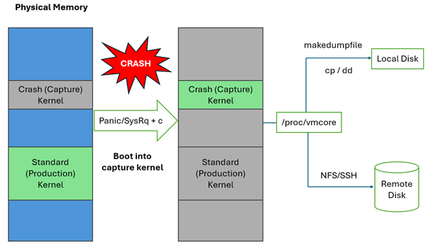
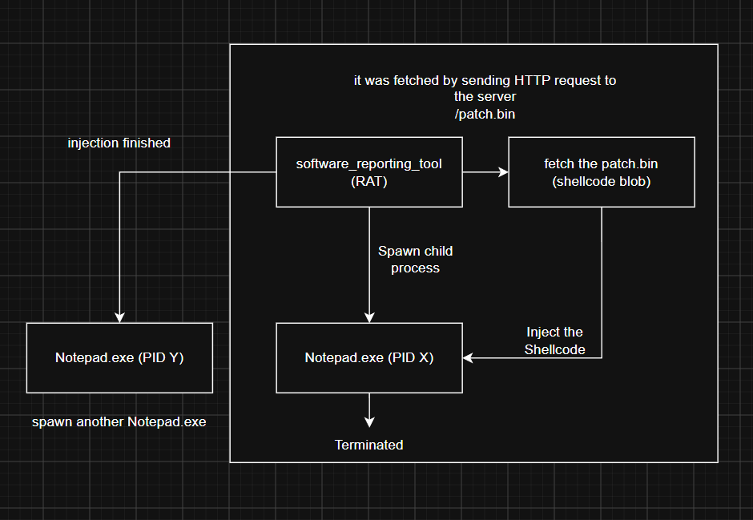
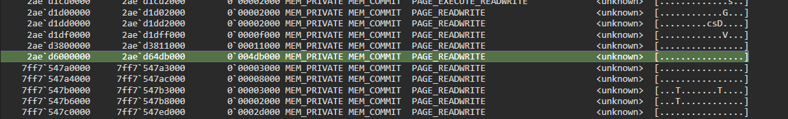
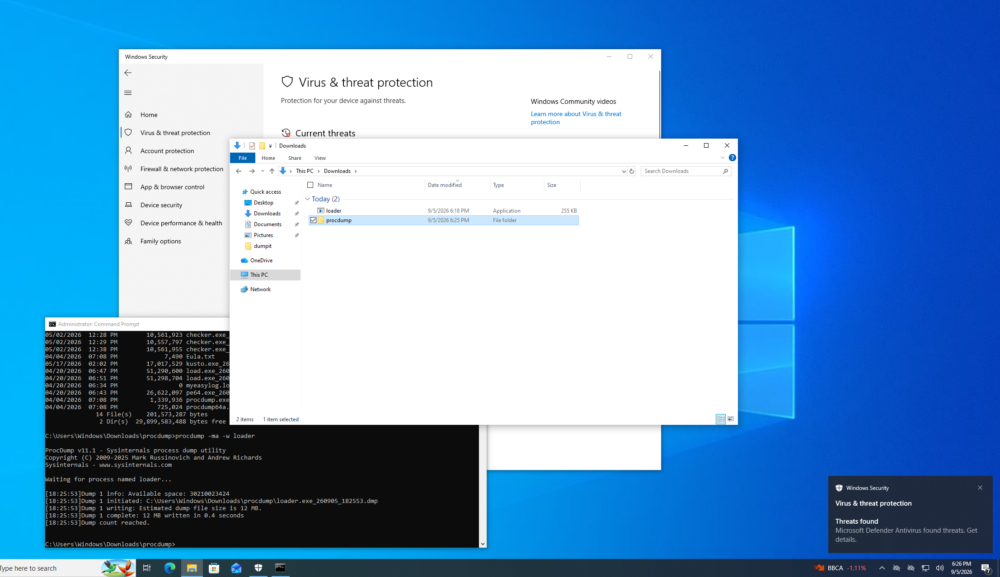
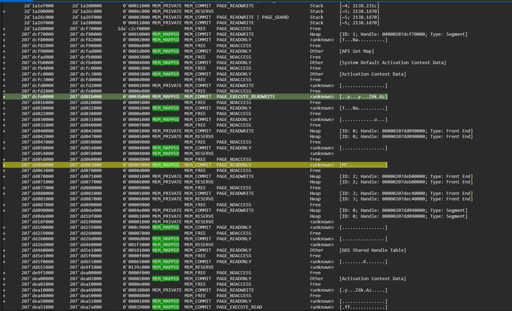
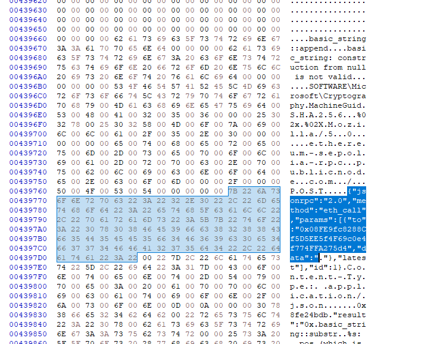
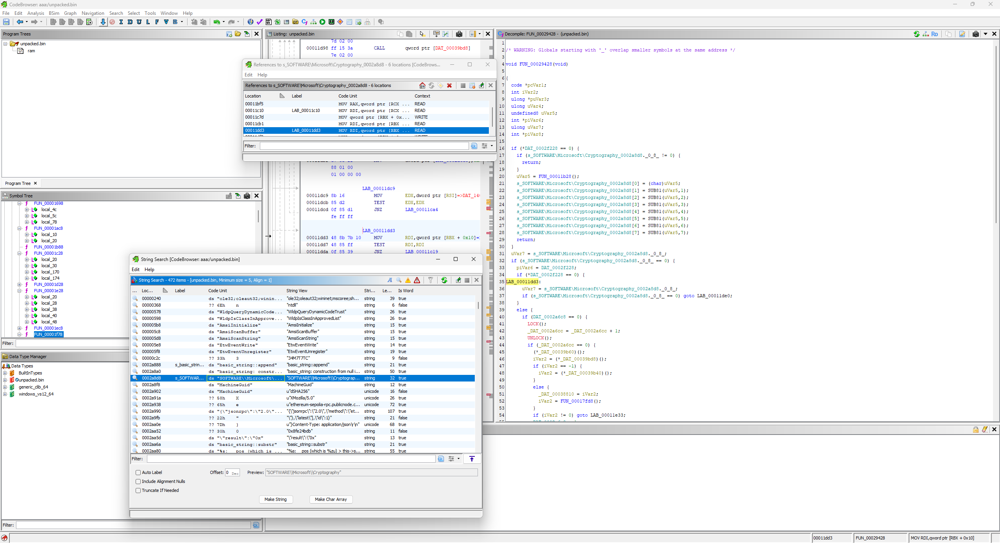

Memory forensics has always been a very broad topic to discuss. As a CTF player focusing on DFIR (people keep saying that DFIR is not a real CTF category, but I don't care), I usually see people creating tool-dependent CTF challenges (maybe like Volatility, MemProcFS, the recently released MemNixFS, etc.)

My guess is that the reason behind this is to keep the challenge as realistic as possible, and I don't hate that. The only thing is, what if... just what if... the attacker, the actor, or the conditions leave you without the most perfect artifact possible, either because of anti-forensic attempts or simply because you are exploring a new domain, for example, a cgroup-scoped memory dump? Who said that was impossible? I think it's an interesting domain to research, an efficient method to capture a specific container (cgroup) for enterprise environments.

<p align="center">
  
</p>

Back to the topic. Based on that opinion, every time I design a new forensic CTF challenge, I always try to explore what methodology would break the players' tooling. In the GEMASTIK XIX Qualification, I tried to create a new custom dump scoped to cgroups to capture a dedicated Docker environment that I used as the target for the attack scenario. In Wreck IT 7.0, I purposely chose to have the ransomed file deleted from the VM to make sure that players needed to carve their ciphertext from the process buffer to solve the challenge (the intended solution was using bulk_extractor to recover the pcap of the exfiltration, but it turned into something more fun, hahaha). And after playing COMPFEST18, I saw something interesting, in the challenge's intended way to recover the injected shellcode from a dropper, bulk_extractor should work to carve the traffic residue so you could get the content length and the header of the shellcode and use that information to carve it from memory. In that case, though, my bulk_extractor couldn't recover the traffic residue, so I needed another way to recover the shellcode artifact.

To be honest, this kind of topic has always been on my mind. I first created this edge case for a challenge in the Cyber Jawara 2024 Final, Cyber Ops Clash 2024, and some events after that. I focus on minidumps when we are talking about Windows, and coredumps when it's about Linux (the latter was only explored in Wreck IT 7.0).

Here, I want to share with everyone that we, as Forensic-focused CTF players, must go deeper beyond the regular guesswork stegoshit or the cool realistic DFIR cases. I think we must do our own research, how an anti-forensic attempt can become a CTF challenge, or any other novel method we can uncover.

### Wreck IT 7.0's It Wrecked (Again) - Linux Coredump Forensics
In the Wreck IT 7.0 Qualification, I created a challenge titled "It Wrecked (Again)". The idea for this challenge came when I was playtesting its intended behavior. While I was carving for stealer traffic evidence from memory using tools like bulk_extractor, I couldn't find anything even though the stealer server received the stolen packets. This issue turned into a new idea for me, with the logic of "if it got processed in memory, it should exist there." So I repeated the playtest and found out that my assumption was indeed correct, the ciphertext resides in the anonymous memory of the process.

I'll skip all the hassle about the attack that happens in the challenge and jump straight into the coredump process.

So the thing is, a coredump is Linux's version of a minidump, lol. A coredump is a file captured per process, containing that process's address space (memory) at the moment the process terminates unexpectedly.

<p align="center">
  
</p>

*(image source: https://community.ibm.com/community/user/blogs/sachin-bappalige/2024/05/16/kdump-and-fadump-linux-features)*

You can read the details here: https://interrupt.memfault.com/blog/linux-coredumps-part-1

### Triaging the Coredump

In the Wreck IT challenge, because the ransomed file was deleted, the only thing left to check (my intended design) was the process memory residue of the attack traces. Flashback, in the challenge scenario there was a vulnerability in a VM's server binary that let an attacker execute a shellcode that ransomed the Linux VM. So players needed to analyze that vulnerable binary, which was pwned by the attacker, to get its encryption method and the ciphertext. The recovery process for the shellcode was very easy, players can literally just use Volatility's linux.malfind to find the shellcode (the plugin searches for anonymous memory mappings that have RWX privileges), but they will miss the ciphertext because it was not in RWX-privileged memory. It was explained in my earlier blog post (https://keii.malwr.es/posts/it-wrecked-again-writeup-wreck-it-7/), but I will re-explain it here....


After mounting the memory dump using MemNixFS, we can directly check the process mapping under the mounted folder of the binary process. In the maps file, we can see this memory mapping:

```
000000400000-000000401000 r--p 00000000 00:00 0          [mapped]
000000401000-000000403000 r-xp 00001000 00:00 0          [mapped]
000000403000-000000404000 r--p 00003000 00:00 0          [mapped]
000000404000-000000405000 r--p 00003000 00:00 0          [mapped]
000000405000-000000406000 rw-p 00004000 00:00 0          [mapped]
00000097b000-00000099c000 rw-p 00000000 00:00 0          
7f4543ac1000-7f4543ac4000 rw-p 00000000 00:00 0          
7f4543ac4000-7f4543aec000 r--p 00000000 00:00 0          [mapped]
7f4543aec000-7f4543c81000 r-xp 00028000 00:00 0          [mapped]
7f4543c81000-7f4543cd9000 r--p 001bd000 00:00 0          [mapped]
7f4543cd9000-7f4543cda000 ---p 00215000 00:00 0          [mapped]
7f4543cda000-7f4543cde000 r--p 00215000 00:00 0          [mapped]
7f4543cde000-7f4543ce0000 rw-p 00219000 00:00 0          [mapped]
7f4543ce0000-7f4543ced000 rw-p 00000000 00:00 0          
7f4543cfb000-7f4543cfe000 rw-p 00000000 00:00 0          
7f4543cfe000-7f4543d00000 r--p 00000000 00:00 0          [mapped]
7f4543d00000-7f4543d2a000 r-xp 00002000 00:00 0          [mapped]
7f4543d2a000-7f4543d35000 r--p 0002c000 00:00 0          [mapped]
7f4543d35000-7f4543d36000 rwxp 00000000 00:00 0          
7f4543d36000-7f4543d38000 r--p 00037000 00:00 0          [mapped]
7f4543d38000-7f4543d3a000 rw-p 00039000 00:00 0          [mapped]
7ffc0d431000-7ffc0d452000 rwxp 00000000 00:00 0          
7ffc0d578000-7ffc0d57c000 r--p 00000000 00:00 0          
7ffc0d57c000-7ffc0d57e000 r-xp 00000000 00:00 0          
```

It's pretty obvious that the rwxp region is the shellcode because of the privileges alone, and it was not a file-backed memory region.
Entries labeled with `[mapped]` and non-zero file offsets (e.g., 00001000, 00028000, 00215000) represent file-backed mappings (such as the main binary image, libc.so, and ld.so) whose absolute file paths could not be resolved by the forensic tool. Anonymous memory regions are identified by a zeroed offset (00000000) and an empty trailing path field.

So, if you are a **HUMAN**, not an AI, you won't brute-force carve memory looking for patterns, you will use this approach instead. And it's pretty clear, LMAO.

***Fun fact, I caught so many AI sloppers in this challenge, they magically knew the specific offsets from the memory itself, directly, and created a Python script to carve it straight from the memory dump, claiming it was created by themselves without a proper explanation or a legit AI chat history link***

***(in local events, we enforce this kind of rule where players are allowed to use a chat-based AI assistant for them to consult or as a coding assistant)***

After finding that `rwxp` memory region, you just take a look at another region that is not file-backed and probably has at least RW, or at least Write, privileges. This already narrows down the search for the ciphertext, and I haven't even explained the methodology of inspecting the coredump yet.

We can take the coredump (.dmp) file that resides in that mounted memory and load it into pwndbg or any other gdb you love. The memory dump also gives you the binary, so this method of course works.

We can also take a look at the memory mapping using `vmmap` in pwndbg.
<p align="center">
  
</p>

And due to the Linux x86-64 memory allocation strategy, we can imagine that the memory structure would look like this:

```
▲ [0x000000000000 - LOWEST VIRTUAL ADDRESS]
│
├─ 0x400000        : Binary Base (.text, .rodata, .data)
├─ 0x97b000        : Heap (brk)
│
├─ 0x7f4543ac1000  : Anonymous Mmap (TLS / Runtime Allocations)
├─ 0x7f4543ac4000  : libc.so.6 Base
├─ 0x7f4543ce0000  : libc BSS / Anonymous Segment
├─ 0x7f4543cfb000  : Ciphertext Buffer (load13)
├─ 0x7f4543cfe000  : ld-linux.so Base (load14)
├─ 0x7f4543d35000  : Injected Shellcode RWX Stub (load17)
│
├─ 0x7ffc0d431000  : User Stack
└─ 0x7ffc0d57c000  : vDSO / Kernel Mapping
│
▼ [0x7fffffffffff - HIGHEST VIRTUAL ADDRESS]
```

You can read the details here: https://howtech.substack.com/p/virtual-memory-layout-mapping-kernel

The idea behind this ciphertext carving in the challenge was so simple, you look for a memory region that has Write privileges, not a file-backed region, learn the Linux memory allocation, and carve it from the coredump. This is literally the idea I applied later in the COMPFEST18 shellcode carving from the loader.

### The Appex Affair from COMPFEST 18 - Windows Minidump Forensic
This approach and ideation was once again used when I played a challenge named The Appex Affairs in `COMPFEST 18`. The Appex Affairs was a QnA-type forensic CTF challenge. It has 26 questions split into 5 parts, if I remember correctly. I won't go into detail about the concept of this challenge; tl;dr, it was about a ransomware case that happened with multiple phases of compromise. I'll directly talk about the idea and approach I used, particularly to dump the injected payload in this challenge.

If in Wreck IT 7.0's It Wrecked (Again) we focused on the RWX-privileged memory section and the buffer of the process, in this Windows side of memory analysis, we'll look at how we can identify what was injected and how it happened.

In the challenge, there was a RAT that was installed on the victim's machine. From this RAT, the attacker injected a shellcode stub into a Notepad.exe process (some kind of process injection) and terminated that injected Notepad. When doing the challenge, I noticed this from the Sysmon log, I forget exactly what it was, whether `ProcessAccess` or `CreateRemoteThread`, but I remember that the RAT's exe suddenly spawned a child process, which was the injected `Notepad.exe`. From that, I noticed that in the given memory dump, the current PID of Notepad.exe and the spawned child process were different, and I confirmed this with the author. So I switched my approach: if we couldn't proceed to analyze the resulting child process, I should instead check its parent process, which was the RAT.

<p align="center">
  
</p>

But the problem was, when I checked the RAT, the shellcode was downloaded from a server that was already inaccessible. So again, I needed to pivot my approach, and the idea that came to me was: if the loader/RAT downloaded something, it must have been written to disk, or at least held as a buffer, to be injected into the targeted process. The idea was that I could examine the RAT's process dump memory to look for the buffer of the download process, which meant looking for a memory region with at least RW privileges.

### Executing the RW Buffer Idea
Using the same procedure with MemNixFS, I could just mount the full memory dump of the challenge on my own host machine, go directly to M:\name\ProcName (which is the software_reporting_tool), and take the minidump from there.

The inspection can be done using WinDbg; we can just use !address to view the memory regions along with their privileges, and narrow down the search by using the -f flag, for example `!address -f:PAGE_READWRITE`

<p align="center">
  
</p>

I noticed that, in the ```2ae`d6000000 ~ 2ae`d64db000``` address range, there is a weirdly non-file-backed memory region (it was of the MEM_PRIVATE type and marked with `<unknown>` in the usage field, which means it was using a custom allocator) that has a large chunk size, `004db000`, which in decimal is almost 5MB. And from that region, we can extract the shellcode by leveraging other info about the shellcode length, which can be viewed from the HTTP request that happened (from the Content-Length).

```
0:000> db 000002ae`d64a0138 L40
000002ae`d64a0138  e8 c0 79 03 00 c0 79 03-00 e4 5a 36 6b da 41 7a  ..y...y...Z6k.Az
000002ae`d64a0148  f4 d2 84 d8 af d2 63 85-0c a5 d1 6f 2b ab 94 00  ......c....o+...
000002ae`d64a0158  2f 34 8d 71 36 79 b3 9d-db 00 00 00 00 1e f8 b8  /4.q6y..........
000002ae`d64a0168  a3 90 65 38 49 4a 4e da-76 24 b3 a2 6e a9 5f 74  ..e8IJN.v$..n._t
```

You can further analyze the cause of this by decompiling the .NET loader/RAT (the software_reporting_tool). From my understanding, this was saved into a byte[] buffer before being injected into the target process, and in my opinion, it makes sense that because of this, the shellcode blob still resides in the process memory of the software_reporting_tool.

After gathering that information, you can just proceed to dump it using the address range and .writemem in WinDbg to retrieve the shellcode buffer. For the next step of this challenge, my guess is that the shellcode is PIC shellcode that was originally a PE/EXE. Maybe that PE/EXE was transformed into PIC shellcode using something like Donut or another packer. We can use the same idea to proceed and unpack the resulting PE/EXE.

### Revealing the Real Payload
So, as I said, my idea was to use my own loader to load that shellcode blob, making it unpack itself, and then dump it using the same method by inspecting its process memory.

<p align="center">
  
</p>

Here, I'm using procdump to make it wait for the injected target process to spawn, and immediately dump its process memory. After that, the method is the same: you analyze the resulting minidump and take a look at its memory regions.

<p align="center">
  
</p>

In the screenshot above, I mark two suspicious regions. The first is obviously the shellcode being injected; the second turned out to be a false positive, it was the MUI resource of Notepad. But luckily, I found these strings:

<p align="center">
  
</p>

And this gave me another insight; still using the same method, I'll search for the string in WinDbg:

```
0:000> s -a 0 L?0x7fffffffffff "Cryptography"
00000207`dea3a8eb  43 72 79 70 74 6f 67 72-61 70 68 79 00 4d 61 63  Cryptography.Mac
00000207`dea7b063  43 72 79 70 74 6f 67 72-61 70 68 79 00 4d 61 63  Cryptography.Mac
```

Looking at the result, ```00000207`dea3a8eb``` and ```00000207`dea7b063``` were under these regions

```
+      207`dea00000      207`dea02000        0`00002000 MEM_MAPPED  MEM_COMMIT  PAGE_READONLY                      Other      [Activation Context Data]
+      207`dea02000      207`dea10000        0`0000e000             MEM_FREE    PAGE_NOACCESS                      Free       
```

And I dove deeper, turns out `Activation Context Data` are data structures in memory containing information that the system can use to redirect an application to load a particular DLL version, COM object instance, or custom window version (https://learn.microsoft.com/en-us/windows/win32/sbscs/activation-contexts). This gave me clearer proof to dump those regions even though they don't contain any MZ header, which is another known feature of Donut (https://github.com/thewover/donut#:~:text=Overwriting%20native%20PE%20headers), you can look it specifically in https://github.com/TheWover/donut/blob/master/loader/inmem_pe.c#L387.

After taking a look at the decompiled pseudocode, I think I got the right unpacked code of the shellcode.

<p align="center">
  
</p>

## Conclusion?
In most of my experience playing CTFs, the Forensics category almost always had the lowest average score in the competition, not because the challenges suck or anything, it's just that the topic covered isn't deep enough, and most of all, people rely too much on their tools. I just want to share, and at the same time learn together with everyone, that forensics has its own novel methods too, there are so many topics that "look like" Forensics (or maybe a bit like Reversing 😭) that we can uncover, and that's fun, you know: anti-forensic attempts, edge-case tool-breaking artifacts, OS internals, and many more we can discuss. Cheers, forensic players!